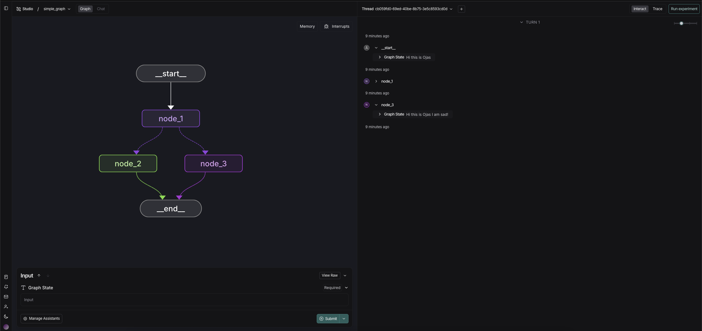
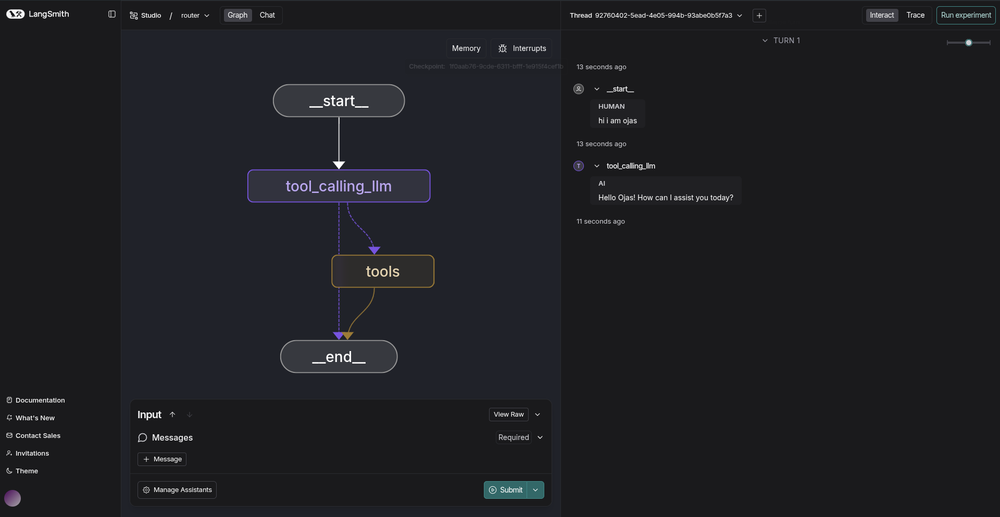
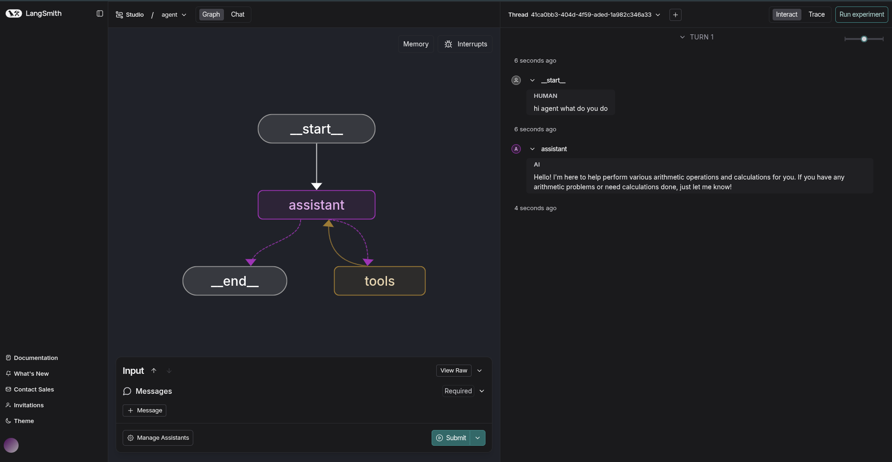

# Introduction to langgraph; Module 1

## Video 1: Simple Graph
[simple-graph.ipynb](resources/module%201/simple-graph.ipynb)
This is a video about simple graphs and their construction. Here we learn how to build a LangGraph with 3 nodes and conditional routing. We define a state schema, create node functions that modify the state, add a conditional edge that routes between nodes based on a 50/50, compiles the graph and invokes it to show execution flow. 

I have changed a few nodes to test the outputs.

## Video 2: LangSmith Studio
This video introduces us to LangSmith Studio, a tool for viewing and "chatting" to our graphs. LangChain calls this a "agent IDE" and we can use this to visualize, interact with, and debug complex agentic applications. I have set it up and gotten it running, but it requires an OpenAI API key, which I hope to replace with an Anthropic key.

## Video 3: Chains
[chain.ipynb](resources/module%201/chain.ipynb)
The third video explains how chains in language model applications are "fixed sequences of steps around model calls", ensuring reliability. The video compares chains with agents that dynamically control flow. Chains are convenient to debug and connect many components to make a complete application.

## Video 4: Router
[router.ipynb](resources/module%201/router.ipynb)
Routers are simple decision-makers that direct the flow of your AI agent based on current conditions, like choosing the next step in a conversation. They act as "if-then" switches, preventing the agent from always following the same path, which makes workflows smarter and more efficient.

## Video 5: Agents
[agent.ipynb](resources/module%201/agent.ipynb)
The video shows how to build useful LangGraph agents, smart AI that lets the LLM decide steps on the fly, unlike fixed chains. It covers easy routers for quick choices, ReAct loops for tool-using agents, adding memory for ongoing chats, and testing in Studio with math examples.

## Video 6: Agent with memory 
[agent-memory.ipynb](resources/module%201/agent-memory.ipynb)
The video teaches building agents with memory in LangGraph using checkpointers like MemorySaver, which save graph state at each step in threads for multi-turn chats, so agents recall prior interactions without losing context. This makes it far more useful.

Using all that we have learnt by now, I have made a code reviewing and editing agent.

[assistant.ipynb](assitant.ipynb)

## Optional Video: Deployment:
[deployment.ipynb](resources/module%201/deployment.ipynb)
The last video teaches deploying LangGraph agents to production using LangGraph Cloud, which hosts graphs as APIs for scalable, monitored applications, while integrating with LangSmith for tracing and debugging executions in real-time. It covers packaging code via GitHub, local testing with SDKs, and transitioning from development (e.g., Studio) to hosted environments for reliable, multi-user access without managing infrastructure.